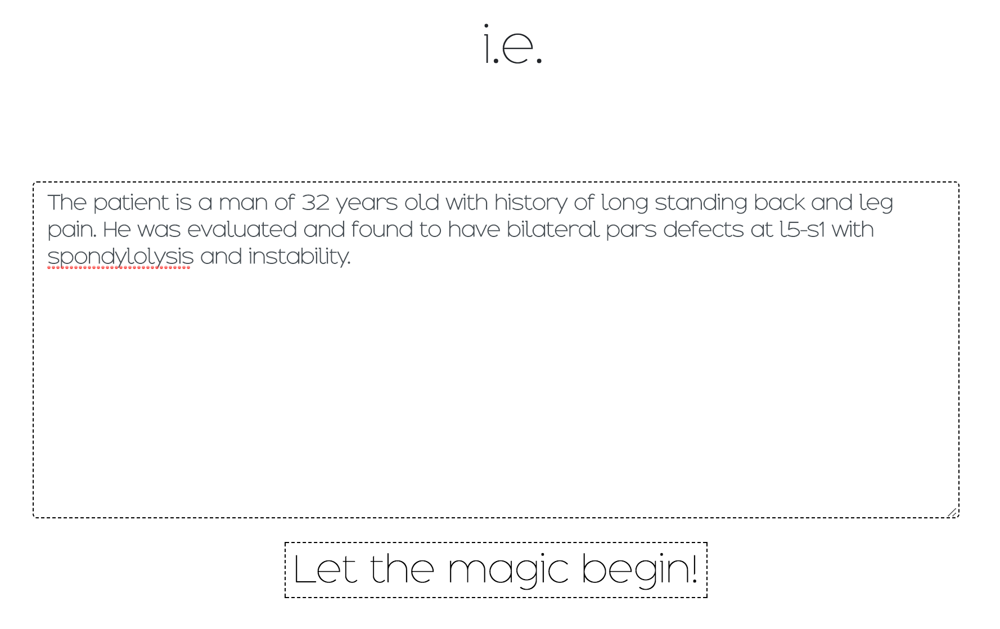
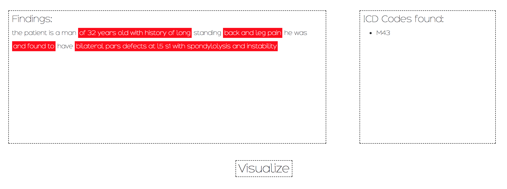
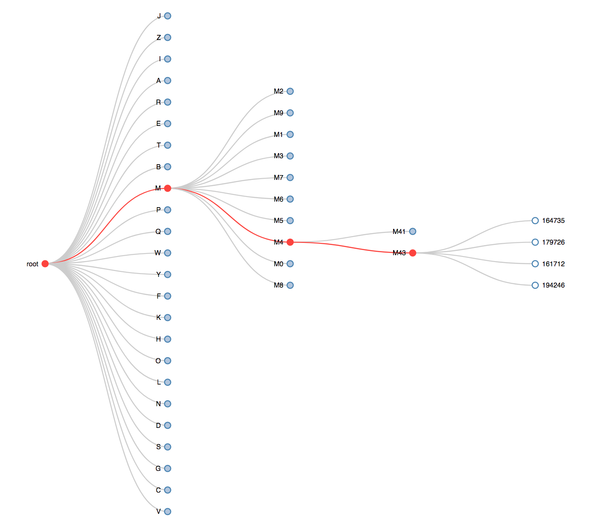

# MedicalContextualHighlighter
Highlight Medical Concepts Using LSTM-Ngram Network

(Some of the Code is Proprietary and Is not Available in the Repository.
Feel free to contact us for reference about the topics.)


## Files

- **bigram.ipynb** and **unigram.ipynb** are the network training notebooks
[future plan is to ensemble multiple models with bigger ngrams. Also lstm for unigram is necessary. A vanilla fully connected neural network should work fine. Because of lack of time during the hackathon, we resorted to using similar code for bigram and unigram models]

- **Highlighter_Bigram.py** and **Highlighter_Unigram.py** are the classes that can be easily imported in the app building scripts.

- **icd_wrapper.py** is pointing to the proprietary script that cannot be disclosed here. 

- **unigram_data_tokenizer.pkl** and **bigram_data_tokenizer.pkl** are the data tokenizers for individual models generated using Keras preprocessing of texts.

- **preprocessing.py** is the copy of [__preprocessing.py)](https://github.com/shams-sam/logic-lab/blob/master/TextPreprocessing/__preprocessing.py) (regularly updated version)

- **init_server.py** is to initialize all the models and bring up the flask server that returns json response to GET queries. It has CORS enabled config which is not recommended in the current form for production utilization.

- Reference for **Q-Map** will also not be available directly as it is proprietary source code.

* Note: There might be some issue with opening notebooks online. Please download the code and open the notebooks on local in that case. Contact me if anything doesn't work.

## [Pre-trained Models](https://drive.google.com/drive/folders/1zh7eKa7nB0_snzqG1fewxSxRHdr25hL4?usp=sharing)

- **lstm_*** model is the v1 model before we decided to ensemble.
- **unigram_*** model and **bigram_*** model are  the ensembled model.

## Screenshots

### Start Screen




### Medical Highlighter 



### Visualizer



## API Call Example
```javascript
$.ajax({
  url: 'http://127.0.0.1:5000/get_info?q=diabetes mellitus',
  type: 'GET',
  success: function (data, textStatus, xhr) {
    console.log(data);
  },
  error: function (xhr, textStatus, errorThrown) {
    console.log('Error in Operation');
  }
});
```
